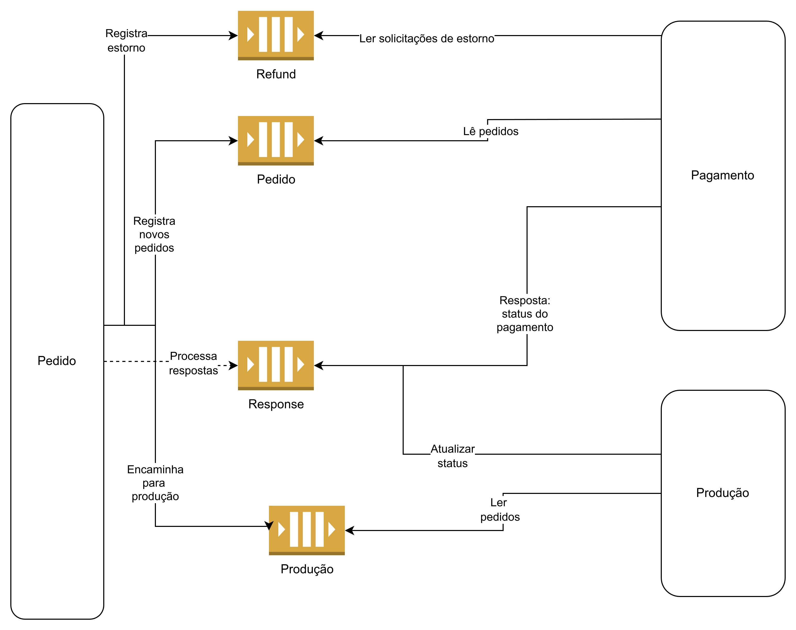

# Aplicação para gerir pedidos de um restaurante
Projeto prático desenvolvido durante a Postech FIAP (Software Architecture).

[Link para o repositório do Github](https://github.com/richardaltmayer/fiap-hexagonal-architecture)

## Arquitetura



### Microsserviços relacionados
- Pedidos (atual)
- [Pagamentos](https://github.com/joasgarcia/fiap-pagamento/)
- [Produção](https://github.com/joasgarcia/fiap-producao/)

### Padrão SAGA

O projeto roda seguindo o modelo de orquestração do padrão SAGA, onde o sistema de principal (pedidos) assume a responsabilidade pelo fluxo inteiro, assim como pelas compensações em caso de falha.

No caso de um pedido de um restaurante, a ordem correta das operações precisa ser estritamente seguida e cada passo depende de um anterior para que ocorra de forma bem sucedida. Da mesma forma, em caso de falha num passo posterior, é preciso desfazer os passos anteriores.

Assim, o orquestrador age muito melhor que uma coreografia, concentrando as verificações necessárias, mantendo uma visão centralizada do processo e simplificando a adição de eventuais novas etapas no futuro, como um serviço de entrega, por exemplo.

A orquestração funciona da seguinte forma:

1. Um novo pedido é registrado;
1. Uma nova cobrança é solicitada via mensageria;
1. O serviço de cobrança recebe a mensagem e processa:
      1. Caso a cobrança falhe, o fluxo é interrompido e uma mensagem de falha é retornada para a mensageria;
      1. Em caso de sucesso, o fluxo continua normalmente e uma mensagem de sucesos é postada na mensageria.
1. O orquestrador verifica a resposta e cancela o pedido ou não;
1. Caso continue, é registrada uma mensagem na fila de produção para preparar o pedido;
1. O serviço de produção recebe a mensagem e processa:
   1. Caso ocorra alguma falha, a produção é interrompida e uma mensagem de falha é postada na mensageria;
   1. Caso tudo ocorra dentro do esperado, uma mensagem de sucesso é retornada.
1. O orquestrador verifica a resposta do serviço de produção e decide:
   1. Caso falhe, é feita uma ação compensatória de estorno, realizada via mensageria e processada pelo serviço de pagamento;
   1. Em caso de sucesso, o pedido fica pronto para ser retirado pelo cliente.

## Evento Storming
https://www.figma.com/file/ad4YsYUo9lsNxWB75KuXWH/Event-Storm---Sistema-para-lanchonete?type=whiteboard&node-id=0%3A1&t=NtciJNRj0z2uN9YQ-1

## Dicionário linguagem ubiqua

- Lanchonete: Estabelecimento comercial que vende lanches e bebidas.
- Pedido: Relação de compra de um cliente na lanchonete que pode conter um ou mais itens
- Item do pedido: Compõe o pedido, pode ser um produto ou um combo de produtos.
- Cliente: Qualquer pessoa que realiza compras numa lanchonete
- Cozinha: Local da lanchonete onde se preparam os pedidos
- Cozinheiro: Profissional contratado pela lanchonete para realizar a preparação dos pedidos
- Gateway de pagamento: Empresa que oferece um meio para processamento de pagamentos. Ex: Asaas, Mercado Pago, Stripe etc.

## Collection da API (Postman)

A lista de endpoints com o payload já configurado basta baixar a [_collection_](./fiap-techchallenge.postman_collection.json) e importá-la no Postman. 

## Como rodar a aplicação

Primeiro, é necessário subir o banco de dados em MySQL:

```shell
docker compose up database -d
```

Em seguida, é possível subir a aplicação Spring Boot:

```shell
# A primeira execução deve passar por um processo de build
docker compose build

# Depois, basta rodar o comando abaixo
docker compose up app 
```

Para testes em ambiente local, é recomendado usar o Localstack. Inicialize a ferramenta com:

```shell
docker compose up localstack --build
```

Então, crie as seguintes filas no SQS, se não houver:
- `payment-q`;
- `payment-refund-q`;
- `production-q`; e
- `response-q`.

Recomenda-se criar e acompanhar as filas pela própria interface do Localstack [neste link](https://app.localstack.cloud/inst/default/resources).

## Como rodar os testes da aplicação

### Via linha de comando
Dentro do diretório do projeto, executar o comando abaixo:

```shell
.\gradlew test
```

Após a execução do comando, é possível visualizar o relatório de execução dos testes, no formato HTML, localizado em:

```shell
> .\build\reports\tests\test\index.html
```

## Cobertura de testes do projeto

Os testes foram construídos, nas diferentes camadas do projeto, utilizando:
- Testes unitários
- Testes de integração
- Testes de comportamento (BDD)

O resumo dos testes de integração e unitários pode ser observado em:


_Os testes de comportamento não constam no resumo acima._

A cobertura de testes desenvolvidos no projeto pode ser observada em:


## Relatório de Impacto de Proteção de Dados

Para visualizar o Relatório de Impacto de Proteção de Dados consulte esse [link](https://docs.google.com/document/d/1qFt32F8fH0thY0iOhRW_RAAAZw-RYRzcKtixA6_6wHQ/edit?usp=sharing).

## OWASP ZAP (ZAP Scanning Reports)

Os relatórios obtidos a partir da ferramenta mostram que os endpoints abaixo não apresentam vulunerabilidades altas, não sendo necessário realizar adequações na implementação, conforme:
- [Product List](https://html-preview.github.io/?url=https://github.com/joasgarcia/fiap-hexagonal-architecture/blob/doc-owasp-zap/src/main/resources/owasp/product-list.html)
- [Checkout](https://html-preview.github.io/?url=https://github.com/joasgarcia/fiap-hexagonal-architecture/blob/doc-owasp-zap/src/main/resources/owasp/checkout.html)
- [Payment](https://html-preview.github.io/?url=https://github.com/joasgarcia/fiap-hexagonal-architecture/blob/doc-owasp-zap/src/main/resources/owasp/payment.html)
- [Payment Confirmation (Webhook)](https://html-preview.github.io/?url=https://github.com/joasgarcia/fiap-hexagonal-architecture/blob/doc-owasp-zap/src/main/resources/owasp/webhook-payment-status.html)
